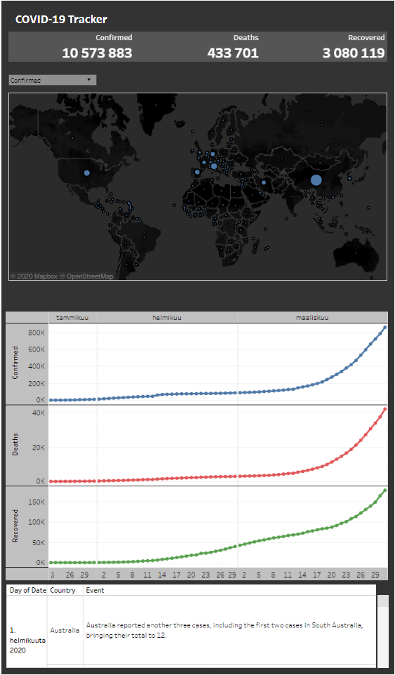

# COVID-19 visualization
Interactive data visualization - project

<a href=https://public.tableau.com/profile/jimi.hytonen#!/vizhome/Covid-19_15853411684190/Covid-19> The Dashboard </a>

## Data Sources:
<a href=https://github.com/CSSEGISandData/COVID-19> JHU Covid-19 </a>
<a href=https://en.wikipedia.org/wiki/Timeline_of_the_2019%E2%80%9320_coronavirus_pandemic_in_February_2020> Wikipedia - Timeline in February</a>
<a href=https://en.wikipedia.org/wiki/Timeline_of_the_2019%E2%80%9320_coronavirus_pandemic_in_March_2020> Wikipedia - Timeline in March </a>

## Prerequisities
Tableau desktop is required to run the visualization. However, you can find the visualization online from <a href=https://public.tableau.com/profile/jimi.hytonen#!/vizhome/Covid-19_15853411684190/Covid-19>here</a>.
